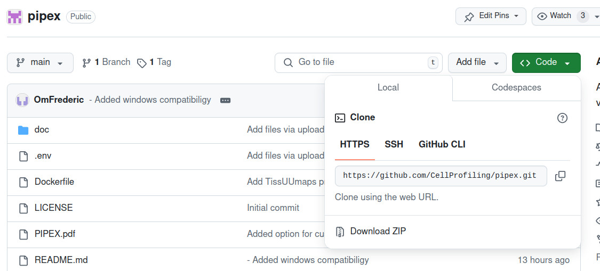
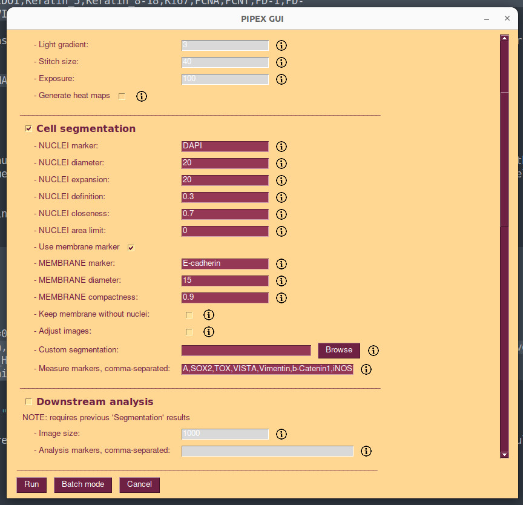
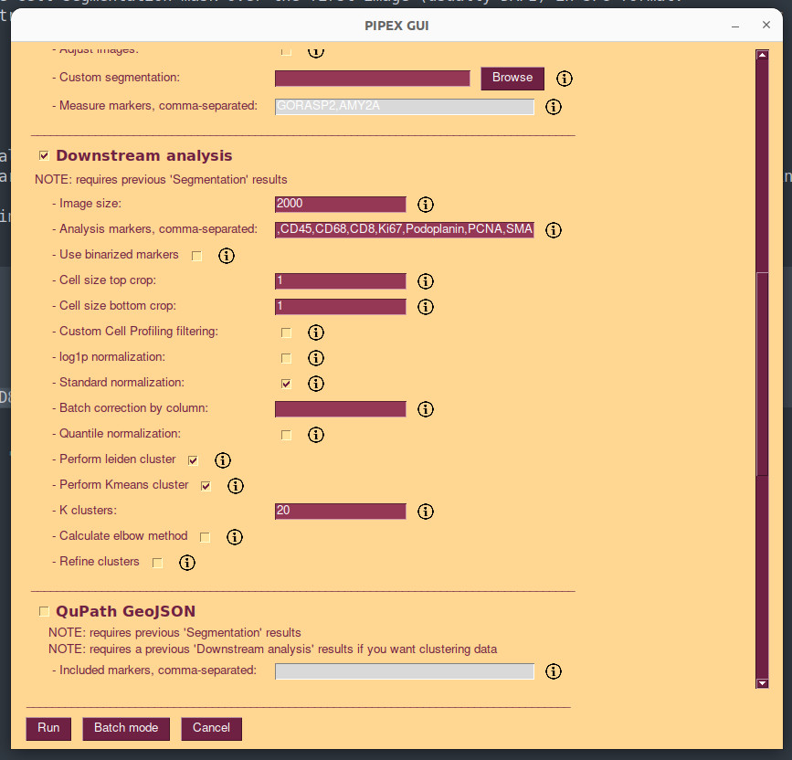
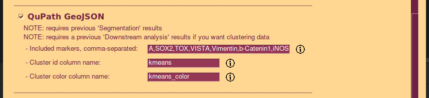
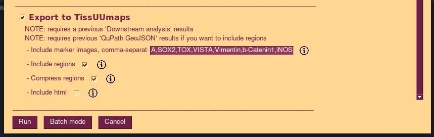
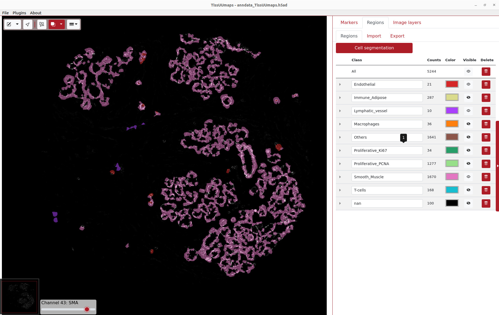

# Multiplexed tissue imaging: tools and approaches

Material for the I2K 2024 "Multiplexed tissue imaging: tools and approaches" workshop

[Workshop slides](https://docs.google.com/presentation/d/1R9-4lXAmTYuyFZpTMDR85SjnLsPZhVZ8/)


PIPEX hands-on workshop
=======================

This hands-on workshop will focus on replicate the most common pipeline steps that researchers do with tissue multiplexed images, which includes:

- Segmenting the tissue cells.
- Quantify the different image markers.
- Perform some statistical analysis: normalization, markers correlation assesments and clustering to define cell types.

Please go over the ***Before the session*** section in advance so you don't saturate the WIFI during the event and don't lose time setting up things!


Before the session
------------------

Please come with a working python setup and minimal experience installing basic code. Anything works: any regular IDE like PyCharm or VSCode, anaconda or directly venv.

Although MacOS is not officialy supported/tested, it should work the same. If you can choose OS, linux works best (as in any other scenario!).

Download/clone code from github ( https://github.com/CellProfiling/pipex ) and install `requirements.txt`. If you are very new to python, you have a very basic example setting up a virtual environment in PIPEX main documentation.



Give PIPEX a try by directly running `pipexGUI.py`, a GUI should appear. The code is ready!

Now create a `data` folder in your code working directory. Download the workshop data ( https://ell-vault.stanford.edu/dav/fredbn/www/I2K/pipex_data.zip ) and extract it to some temporary folder. Copy all the `.tiff` files located into the extracted `data`  folder into the `data` folder in your workspace directory.

Finally, PIPEX is integrated with TissUUmaps viewer for easy interaction with the marker images and clustering results. You can install TissUUmaps from here ( https://tissuumaps.github.io/installation ). For windows users: install version 3.2.1.9 as administrator!

You are set to go! To run PIPEX from now on:

- Run `sh pipex.sh` (linux, this will give you a nice `log.txt` file with more information)
- Run `python pipexGUI.py` directly (Windows)


Workshop data
-------------

We are going to work with a breast tissue sample (normal donor) from the Human Protein Atlas v24 dataset, soon to be publicly available. This is one of the tissues which many of the HPA antibodies are tested on. You can explore the marker images here:

https://ell-vault.stanford.edu/dav/fredbn/www/I2K/viewer/viewer.html?csv=https://ell-vault.stanford.edu/dav/fredbn/www/I2K/viewer/TMA_H243_normal_tissue_breast_core2_data.csv&maxIntensity=255&pixelToMicron=0.5073077046562237&preRender=3200

The complete list of markers (named "complete markers" from now on) available for this tissue section is:

`ARL13B,ATM,Bcl-2,Beta-actin,CD107a,CD11c,CD14,CD163,CD20,CD31,CD34,CD39,CD3e,CD4,CD40,CD44,CD45,CD56,CD68,CD8,Caveolin,Collagen_IV,DAPI,E-cadherin,ER,EpCam,GP100,HIF1A,HLA-A,HLA-DR,Histone_H3_pSer28,ICOS,IDO1,Keratin_5,Keratin_8-18,Ki67,PCNA,PCNT,PD-1,PD-L1,Pan-Cytokeratin,Podoplanin,SMA,SOX2,TOX,VISTA,Vimentin,b-Catenin1,iNOS`

Being the tissue normal (without known disease or treatment) we are going to focus on studying some regular structural and immune markers (named "analysis markers" from now on) present in the breast:

`CD31,CD40,CD45,CD68,CD8,Ki67,Podoplanin,PCNA,SMA`

Short and very inaccurate marker explanation:

```
SMA - Smooth Muscle, structures with soft muscle present
CD31 - Endothelial cells, general blood vessels
Podoplanin - Lymphatic vessels
CD45 - Hematopoietic cells, generic for most immune cells
CD8 - T-cells, described in the breast ductal lobes
CD68 - Macrophages
CD40 - Immune cells, studies suggesting they may be related with adipose tissue
PCNA - Proliferative cells
Ki67 - Proliferative cells
```


Segmentation
------------

PIPEX offers a customizable combination of nuclei segmentation through Stardist and membrane segmentation through watershed. For this sample we are going to use `DAPI` as nuclei marker and `E-cadherin` as membrane marker, to try to get a more close to reality segmentation in the glandular cells regions than just a basic nuclear expansion.

Run PIPEX `Cell segmentation` step with the following parameters (leave the rest blank or with the default values):

```
-nuclei_marker=DAPI 
-nuclei_diameter=20 
-nuclei_expansion=20 
-nuclei_definition=0.3 
-nuclei_closeness=0.7
-membrane_marker=E-cadherin 
-membrane_diameter=15 -membrane_compactness=0.9 
-measure_markers=ARL13B,ATM,Bcl-2,Beta-actin,CD107a,CD11c,CD14,CD163,CD20,CD31,CD34,CD39,CD3e,CD4,CD40,CD44,CD45,CD56,CD68,CD8,Caveolin,Collagen_IV,DAPI,E-cadherin,ER,EpCam,GP100,HIF1A,HLA-A,HLA-DR,Histone_H3_pSer28,ICOS,IDO1,Keratin_5,Keratin_8-18,Ki67,PCNA,PCNT,PD-1,PD-L1,Pan-Cytokeratin,Podoplanin,SMA,SOX2,TOX,VISTA,Vimentin,b-Catenin1,iNOS
```



PIPEX will calculate the segmentation and create a `cell_data.csv` file with all markers quantified by cell. You can find the results in the generated `analysis` directory inside your `data` folder. Amongst other things, you will find:

- `segmentation_data.npy` file: the labelled cell regions in numpy array format (for further computing analysis).
- `segmentation_mask_show.jpg` file: the cell segmentation mask over the first image (usually DAPI) in JPG format.
- `cell_data.csv` file: the Flow Cytometry Standard file (as CSV) with cell segmentation metadata and all markers intensities calculated (and clustering if analysis step has been performed).


Analysis
--------

PIPEX offers an automatic downstream analysis to start exploring your marker properties. Although powerful, this is not meant to be a replacement for more targeted analysis over the quantified markers; but it can quickstart many of the common steps and give you some interesting initial hints. 

Run PIPEX `Downstream analysis` step with the following parameters (leave the rest blank or with the default values):

```
-image_size=2000 
-cellsize_max=1 
-cellsize_min=1
-leiden=yes 
-kmeans=yes 
-k_clusters=20 
-analysis_markers=CD31,CD40,CD45,CD68,CD8,Ki67,Podoplanin,PCNA,SMA
```



PIPEX will calculate normalizations and unsupervised clustering over the quantified markers. You can find the results in the generated `analysis/downstream` directory inside your `data` folder. Amongst other things, you will find:

- `correlation_heatmap.jpg` file: this plot shows how correlated are your analysis markers.
- `kmeans_clusters_correlation_heatmap.jpg` file: this plot shows how correlated are the resulting clusters with your analysis markers.
- `rank_genes_groups_kmeans.jpg` file: this series of plots show the influence of the markers over each resulting cluster.
- `show_spatial_kmeans.jpg` file: a spatial plot of the resulting cluster.
- `cell_data_norm.csv` file: this is a mirror of the original `cell_data.csv` file but with all thresholding, normalizations and batch corrections performed over the marker columns. You can transfer what you like to the original data file or explore it separately.
- `cell_data.csv` file has been updated with new columns, `leiden,leiden_color,kmeans,kmeans_color`, with the resulting unsupervised clusters classes.


TissUUmaps integration
----------------------

TissUUmaps offers you a more graphical and convenient way to explore your clustering results over the markers images. You can export the previous results in a format accepted by the TissUUmaps viewer very easily. 

Run PIPEX `QuPath GeoJSON` AND `Export to TissUUmaps` steps with the following parameters (leave the rest blank or with the default values):

```
-included_markers=ARL13B,ATM,Bcl-2,Beta-actin,CD107a,CD11c,CD14,CD163,CD20,CD31,CD34,CD39,CD3e,CD4,CD40,CD44,CD45,CD56,CD68,CD8,Caveolin,Collagen_IV,DAPI,E-cadherin,ER,EpCam,GP100,HIF1A,HLA-A,HLA-DR,Histone_H3_pSer28,ICOS,IDO1,Keratin_5,Keratin_8-18,Ki67,PCNA,PCNT,PD-1,PD-L1,Pan-Cytokeratin,Podoplanin,SMA,SOX2,TOX,VISTA,Vimentin,b-Catenin1,iNOS
-cluster_id=kmeans 
-cluster_color=kmeans_color
```



```
-included_marker_images=ARL13B,ATM,Bcl-2,Beta-actin,CD107a,CD11c,CD14,CD163,CD20,CD31,CD34,CD39,CD3e,CD4,CD40,CD44,CD45,CD56,CD68,CD8,Caveolin,Collagen_IV,DAPI,E-cadherin,ER,EpCam,GP100,HIF1A,HLA-A,HLA-DR,Histone_H3_pSer28,ICOS,IDO1,Keratin_5,Keratin_8-18,Ki67,PCNA,PCNT,PD-1,PD-L1,Pan-Cytokeratin,Podoplanin,SMA,SOX2,TOX,VISTA,Vimentin,b-Catenin1,iNOS
-include_geojson=yes 
-compress_geojson=yes
```



PIPEX will export the previous segmentation and clustering data into new formats easy to integrate in TissUUmaps and other applications (like QuPath). You can find the results in the generated `analysis` and `analysis/downstream` directory inside your `data` folder. Amongst other things, you will find:

- `cell_segmentation_geo.json` file: the GEOjson file that can be imported in QuPath as cell segmentation (and clustering if analysis command has been performed).
- `anndata_TissUUmaps.h5ad`: TissUUmaps project file.

Now you can open the `anndata_TissUUmaps.h5ad` with the TissUUmaps application and explore your results.


Bonus: cluster annotation
-------------------------

Patterns detected by unsupervised clusters are by definition only focused on the input features, regardless of any kind of high-level biology knowledge. A common technique is to allow the unsupervised clustering method to find as many patterns/classes as possible and then merge the similar ones exploring its ranked markers.

If we check the different plots included in `rank_genes_groups_kmeans.jpg` file we can merge similar patterns into a super-class with a reasonable biological name. My take on the data is the following merging:

```
class 	      ranked markers 	merged class
0 		SMA only low             Smooth_Muscle
1 		SMA + PCNA               Smooth_Muscle
2 		PCNA                     Proliferative_PCNA
3 		CD45 + CD8               T-cells
4 		Podoplanin + CD31        Lymphatic_vessel
5 		SMA                      Smooth_Muscle
6 		All negative             Others
7 		CD40                     Inmune_adipose
8 		CD45 + CD8               T-cells
9 		PCNA                     Proliferative_PCNA
10 		SMA mixed with inmuno    Smooth_Muscle
11 		PCNA + CD68              Proliferative_PCNA
12 		CD40                     Inmune_adipose
13 		CD68                     Macrophages
14 		PCNA mixed with inmuno   Proliferative_PCNA
15 		CD 31 only               Endothelial
16 		SMA                      Smooth_Muscle
17 		SMA                      Smooth_Muscle
18 		CD40                     Inmune_adipose
19 		Ki67 + PCNA              Proliferative_Ki67
```

You can get this annotation done in the extracted data of the workshop, the `cell_data_ANNOTATED.csv` file under `data/analysis` directory. To explore it nicely in TissUUMaps we need to do the following steps:

- Save your previous `cell_data.csv` file somewhere.
- Put the `cell_data_ANNOTATED.csv` file in your working `data/analysis` folder and rename it as `cell_data.csv`.
- Run PIPEX `QuPath GeoJSON` AND `Export to TissUUmaps` steps with the following parameters (please notice the change of the column names to "kmeans_annotated" and "kmeans_annotated_color"!):

```
-included_markers=ARL13B,ATM,Bcl-2,Beta-actin,CD107a,CD11c,CD14,CD163,CD20,CD31,CD34,CD39,CD3e,CD4,CD40,CD44,CD45,CD56,CD68,CD8,Caveolin,Collagen_IV,DAPI,E-cadherin,ER,EpCam,GP100,HIF1A,HLA-A,HLA-DR,Histone_H3_pSer28,ICOS,IDO1,Keratin_5,Keratin_8-18,Ki67,PCNA,PCNT,PD-1,PD-L1,Pan-Cytokeratin,Podoplanin,SMA,SOX2,TOX,VISTA,Vimentin,b-Catenin1,iNOS
-cluster_id=kmeans_annotated
-cluster_color=kmeans_annotated_color
```

```
-included_marker_images=ARL13B,ATM,Bcl-2,Beta-actin,CD107a,CD11c,CD14,CD163,CD20,CD31,CD34,CD39,CD3e,CD4,CD40,CD44,CD45,CD56,CD68,CD8,Caveolin,Collagen_IV,DAPI,E-cadherin,ER,EpCam,GP100,HIF1A,HLA-A,HLA-DR,Histone_H3_pSer28,ICOS,IDO1,Keratin_5,Keratin_8-18,Ki67,PCNA,PCNT,PD-1,PD-L1,Pan-Cytokeratin,Podoplanin,SMA,SOX2,TOX,VISTA,Vimentin,b-Catenin1,iNOS
-include_geojson=yes 
-compress_geojson=yes
```

- Open the `anndata_TissUUmaps.h5ad` with the TissUUmaps application and explore your nicely merged results!


